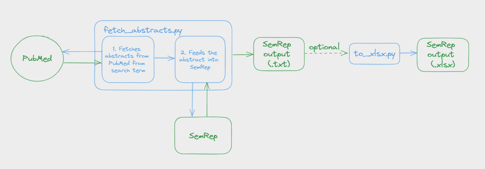

# Applications of VO-SemRep

## Overview on How to Use
### Setup
1. Install Python (>=3.8).
2. Initialize Python virtual environment and install dependencies.
```
python3 -m venv env
source env/bin/activate
pip install -r requirements.txt
```
3. Activate SKR/Medpost Part-of-Speech Tagger Server and Word Sense Disambiguation (WSD) Server for SemRep.
```
cd <path>/public_mm
./bin/skrmedpostctl start       
./bin/wsdserverctl start

! replace with stop to deactivate the servers !
```
### How it works

The "fetch_abstracts.py" script will fetch a collection of PubMed IDs of matching results. Then, for each of the PubMed ID, it will get the title and the abstract text and write it into a file "input_abstract.txt". Then, this file will be processed by SemRep. This means that, at one time, only one abstract is processed in order to avoid SemRep halting when encountering any errors. The result for an abstract is then passed into "dummy_output.txt" and appended into "semrep_output.txt".  

I've included a txt-to-xlsx SemRep output converter in case anyone would like to analyze the data in tabular form. Note that in the script, I've also included certainty prediction for each entry.

### How to use
Before using fetch_abstrcts.py, check and change the hard-coded values.
```
batch_size = 10     # Processes 10 PubMed IDs at one time (control # of API calls)
retmax = 1000       # Return a max of 1000 search results 
command = 'semrep.v1.8 -M -Z <YEAR><AB/AA> -V <VO_database> input_abstract.txt dummy_output.txt'
```
Once the values are set, run the following code and input according to the prompts
```
>> python3 fetch_abstracts.py "name@email.com"     # Change the email
Search term: <enter keyword to search (i.e. brucella vaccines)>
Enter the relative relevant year (1,2,5,etc.): <enter number of year>
...
```

Optional: to_xlsx.py
If you want to use the txt-to-xlsx semrep output converter, ensure that you change the input and output file path before running the script
```
input_file_path = <Enter .txt input file path>
output_excel_path = <Enter .xlsx output file path>

# Example
input_file_path = 'VO_output/sciminer_med_VO.txt'
output_excel_path = 'VO_output/sciminer_med_VO2.xlsx'
```

## Examples of Use Cases
### Use Case 1: Discovering vaccine knowledge about Brucella vaccines


